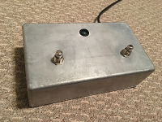

# Echorepl
## Looping audio in Common Lisp, mostly

###Introduction
I originally wanted to make a looper pedal that works with a microphone. As I progressed, I found that what I really wanted was for recording music on a computer to feel as unencumbered as programming Common Lisp with Slime. It turned out the best way to do this was to make the looper a program with Common Lisp and Slime.

###Dependencies:
You'll need Jack for the audio stuff, and libsndfile to save sound files. Other bits of C under the hood are mostly POSIX things that work in Linux, and might work elsewhere. I have found this to work on both CCL and SBCL.

###Installation:
In the main "echorepl/" directory, run "make" to build two C libraries that live in subdirectories. Install (a link to) "echorepl.asd" however you usually install ASDF packages. If you use Slime Mode, then for extra fun you could have emacs load "echorepl/edit-score.el".

###The Pedal:
I made a pedal to control echorepl:

It's an arduino controller with one RGB LED and two momentary stomp switches. The source code for the pedal itself is in the folder "echorepl/pedal/pedal/". It would have been possible to program the pedal as a USB MIDI controller, but loading that onto the arduino seems to be a whole different process. This is a simple program that sends button actions to the serial port as soon as they happen, and accepts messages to light the LED. From my experience, the timing of gestures sent plainly over serial is "good enough."

You don't need the pedal to try out the software. If you run `(loop-button)` in your repl, it does the same thing as stomping on Button A of the pedal. Likewise with `(undo-button)`, and `(reverse-time)` and holding or double-tapping Button B.

###Usage
To start:
`(require 'echorepl)
(in-package :echorepl)
(start-recording)`
Control:
`(loop-button)` or Button A on the stomp pedal: one tap starts recording, the next tap starts looping. If you set *latency* in "echorepl/package.lisp", then layered loops should sync properly.
`(undo-button)` or holding Button B will delete the last loop
`(reverse-time)` or double-tapping button B will run the clock backwards. Audio will play and record in reverse.

`(time-rate new-rate)` with change the playback and recording speed. This is not time-stretching, as in autotune. It's more like running the tape at a different speed. If you double the speed, everything will play an octave higher. If you record at that speed, then when you return the speed to normal what you recorded will be an octave lower. You can also set fractional speeds.

###The Score
Audio clips are saved in `*clip-store*`. In `*score*` there's an arrangement of those clips. The names of clips are generally keywords, like `:clip571`. All the clips named in *score* are looped at the same time. If you want to make a clip louder, softer, or silent, the "gain" and "mute" functions will help. Gain is measured in decibels, with 100dB being unity gain. In the following example, :clip571 is twice as loud as :clip572, while :clip573 is silent:
`((gain 106 :clip571) :clip572 (mute :clip573))`

The "series" function will play one clip after another, instead of looping them at the same time. "Repeat" repeats a clip. So in the following example, :clip488 will play twice, followed by a rest the same length as :clip488:
`((series (repeat 2 :clip488) (mute :clip488)))`

###Slime Features
It is cumbersome to edit *score* with `(setf *score* '(:clip123 ... etc. etc.))`, though this is an option. If you're running Slime, and have loaded "echorepl/edit-score.el", you could also press "C-c e" to run (echorepl-edit-score). That will open a buffer with *score* in it (this reuses functionality from slime-edit-value). Press "C-c C-c" to commit changes. You can also press "C-c r" to change the name of a clip, so that you can read and type :congas or :bass or whatever, instead of :clip2548.

###Saving Projects
`(save-project "/home/you/recordings/awesome-groove/")` will do about what you would hope. `(load-project "/home/you/recordings/awesome-groove/") should also give satisfaction. Save-project creates or uses the directory named. If there's already a score in that directory, or same-named .WAV files, echorepl will overwrite them without compunction.
